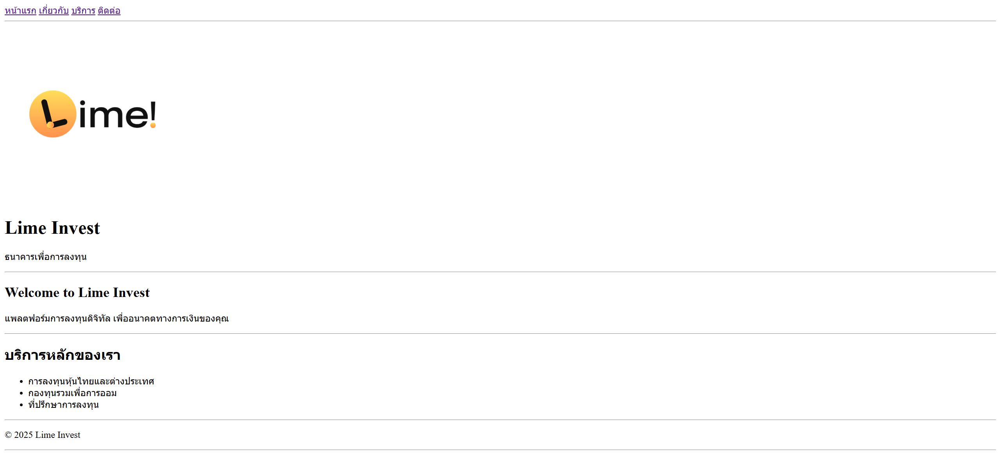
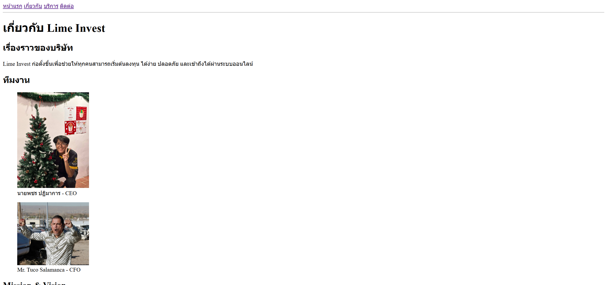
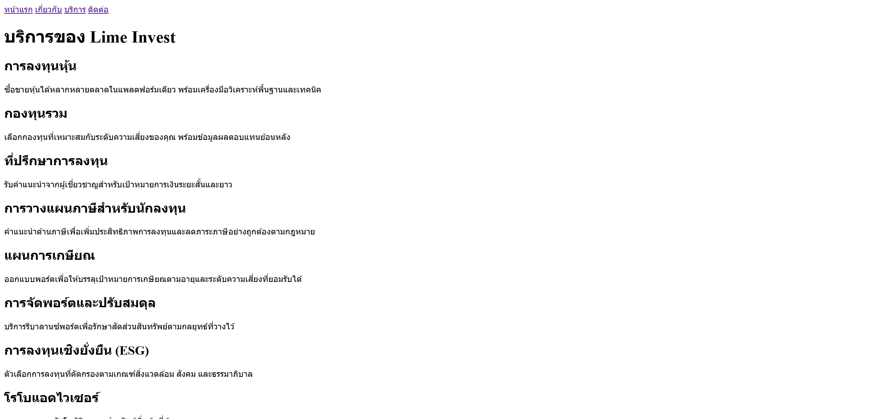
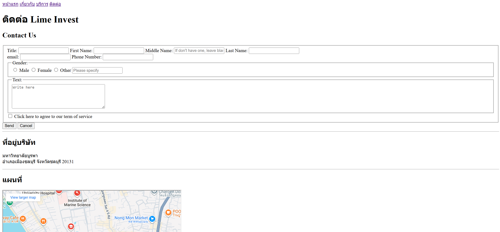

# Lime Invest 

**คำอธิบายโปรเจค:**
- ชื่อ: Lime Invest
- คำอธิบาย: เว็บไซต์สาธิตสำหรับบริการลงทุนแบบดิจิทัล ประกอบด้วยหน้าหลัก หน้าเกี่ยวกับ หน้าบริการ และหน้าติดต่อ

**โครงสร้างไฟล์ (ที่สำคัญ):**

- `index.html` — หน้าแรก (Hero, บริการเด่น)
- `about.html` — หน้าเกี่ยวกับบริษัท และทีมงาน
- `services.html` — รายการบริการและตารางเปรียบเทียบแพ็กเกจ
- `contact.html` — ฟอร์มติดต่อ, ที่อยู่ และแผนที่
- `images/` — โฟลเดอร์สำหรับโลโก้ รูปทีม และภาพประกอบ (รวมไฟล์รูปหน้าจอที่แนะนำให้วาง)

**รูปหน้าจอ (Screenshots)**

- หน้าแรก: `images/index.png`
  
- เกี่ยวกับ: `images/about.png`
  
- บริการ: `images/services.png`
  
- ติดต่อ: `images/contact.png`
  

**ลิงก์ไปยังแต่ละหน้า (ไฟล์ภายในโปรเจค):**

- หน้าแรก: `index.html` — ./index.html
- เกี่ยวกับ: `about.html` — ./about.html
- บริการ: `services.html` — ./services.html
- ติดต่อ: `contact.html` — ./contact.html

