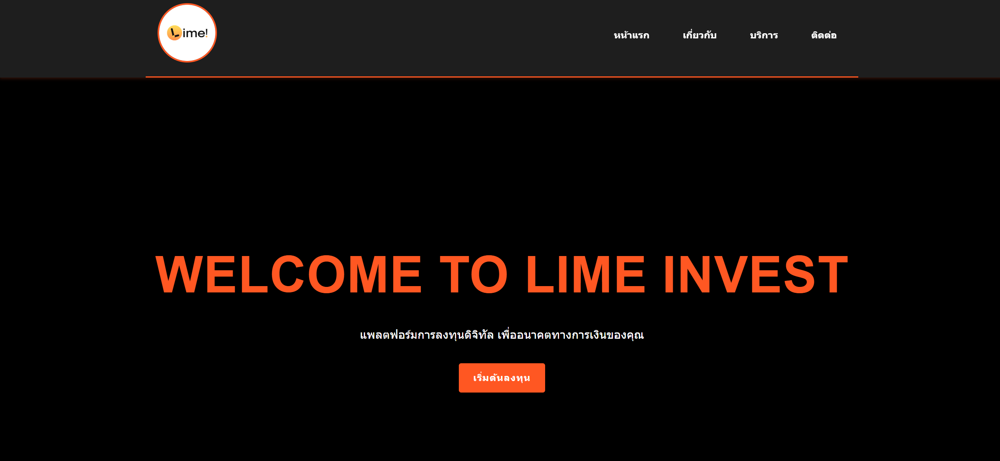
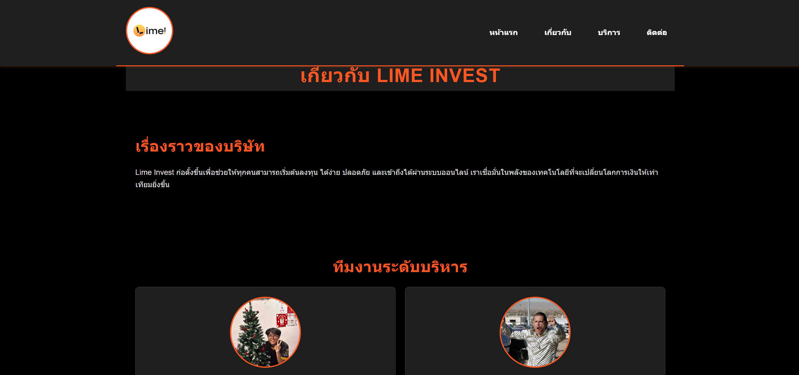
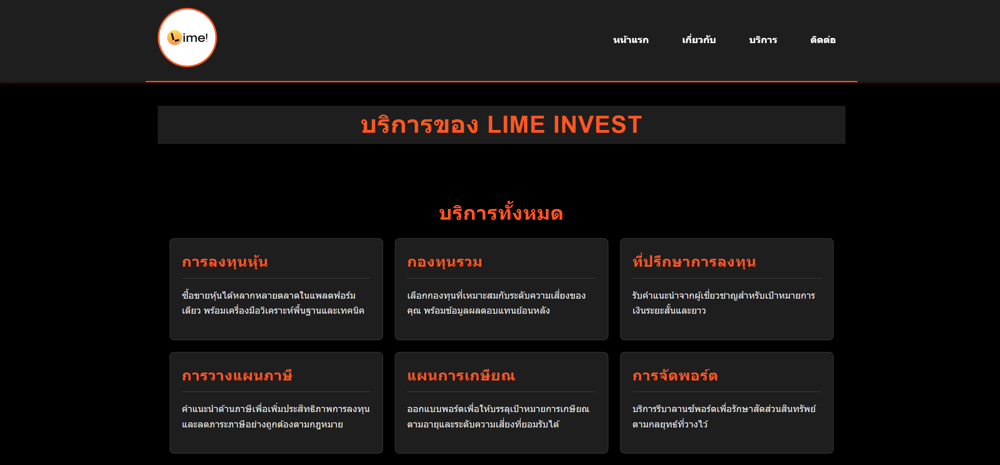
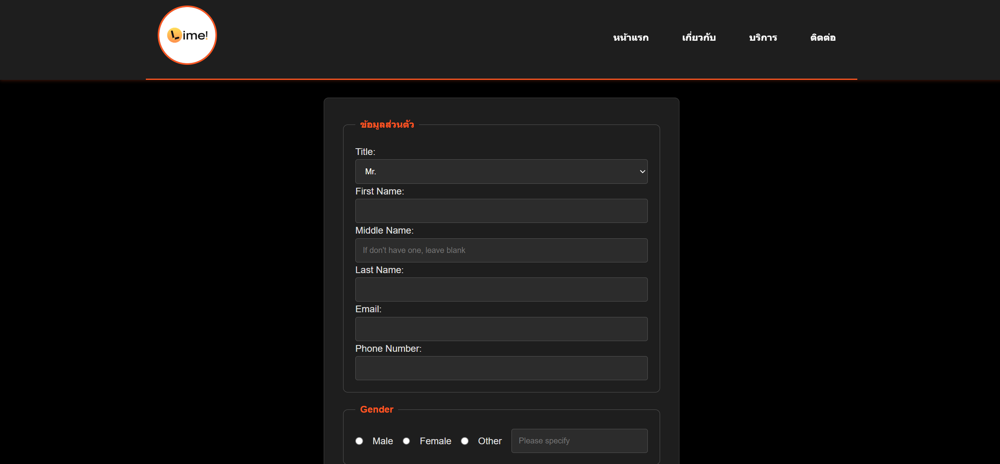

# Lime Invest

**คำอธิบายโปรเจค:**
- ชื่อ: Lime Invest
- คำอธิบาย: เว็บไซต์สาธิตสำหรับบริการลงทุนแบบดิจิทัล ประกอบด้วยหน้าหลัก หน้าเกี่ยวกับ หน้าบริการ และหน้าติดต่อ

**Key Features (สิ่งที่พัฒนาเพิ่ม):**
1. **Design System & Theme**:
    - **Strong Orange & Black Theme**: ใช้สีส้มสด (`#ff5722`) ตัดกับพื้นหลังสีดำ (`#000`)
    - **Typography**: จัดการขนาดตัวอักษรตาม Hierarchy (h1-h4)
2. **Responsive Layouts**:
    - **Flexbox**: ใช้จัดการ Navigation และ Cards
    - **CSS Grid**: ใช้จัดการ Team Member Layout
3. **Advanced Interactions**:
    - **Hover Effects**: ปุ่มและการ์ดมีการขยับและเรืองแสงเมื่อวางเมาส์
    - **Sticky Header**: เมนูนำทางติดด้านบนตลอดเวลา
4. **Code Quality**:
    - **Organization**: แบ่งไฟล์ CSS เป็นหมวดหมู่ (Reset, Typography, Layout, Components)
    - **File Structure**: แยกไฟล์ CSS ไว้ในโฟลเดอร์ `css/styles.css`

**โครงสร้างไฟล์ (ที่สำคัญ):**

- `index.html` — หน้าแรก (Hero, บริการเด่น)
- `about.html` — หน้าเกี่ยวกับบริษัท และทีมงาน
- `services.html` — รายการบริการและตารางเปรียบเทียบแพ็กเกจ
- `contact.html` — ฟอร์มติดต่อ, ที่อยู่ และแผนที่
- `css/styles.css` — ไฟล์ Style หลักของโปรเจค
- `images/` — โฟลเดอร์สำหรับ assets

**รูปหน้าจอ (Screenshots)**

- **หน้าแรก (Index)**: [`index.html`](index.html)
  - Original: `images/index.png`
  
  - **Styled**: `images/index_style.png`
  

- **เกี่ยวกับ (About)**: [`about.html`](about.html)
  - Original: `images/about.png`
  
  - **Styled**: `images/about_style.png`
  

- **บริการ (Services)**: [`services.html`](services.html)
  - Original: `images/services.png`
  
  - **Styled**: `images/services_style.png`
  

- **ติดต่อ (Contact)**: [`contact.html`](contact.html)
  - Original: `images/contact.png`
  
  - **Styled**: `images/contact_style.png`
  
